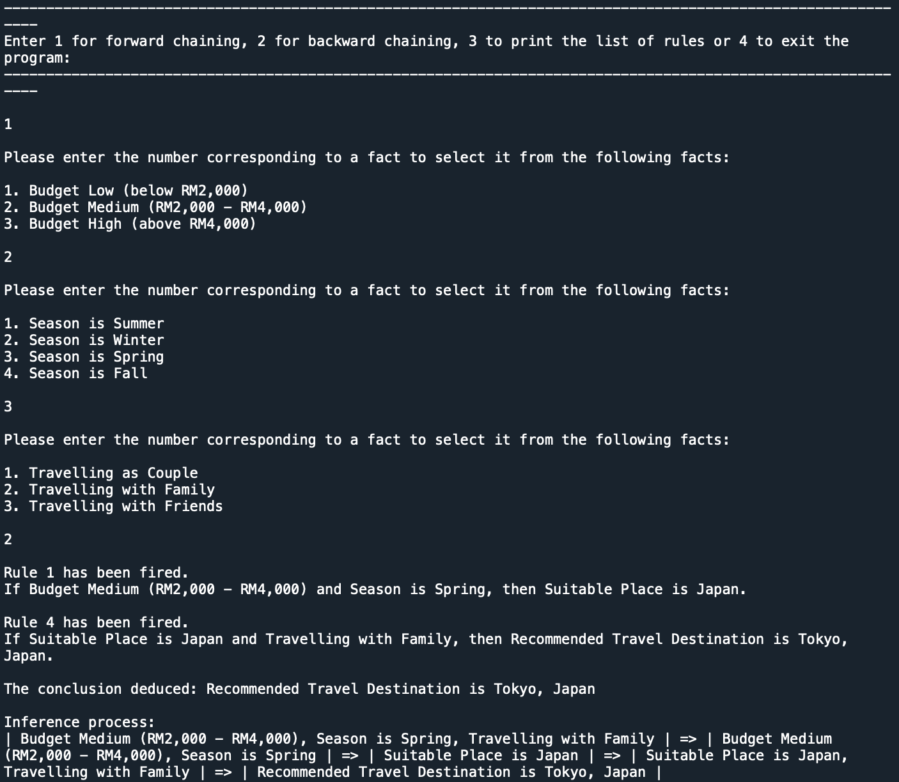

# TravelDestPS
A production system which aims to assist people(s) who are looking to travel by suggesting the most ideal travel destinations available to them based on their budget, their preferred season, and their travel companions.

## Running the algorithm
- Put all .py files in the same directory, and run main.py using a Python IDE.  
- It is recommended to run this algorithm on Python IDEs that supports the integration of matplotlib such as Spyder.

## Problem Description
In this problem, I aim to create a production system which prompts the user for input by asking questions through an interface and that the system can perform both forward and backward chaining based on the user’s input. The problem I am trying to solve is that this system can respond appropriately according to user inputs and perform both forward and backward chaining of rules so that the user receives the most ideal suggestions (conclusion) available to them based on the system’s database. Therefore, I have chosen to create a production system which gives recommendations on travel destinations based on the user’s input (forward chain) and the most ideal criteria to travel to the destination (backward chain). Our main objective from this system is to assist people(s) who are looking to travel by suggesting the most ideal travel destinations available to them based on their budget, their preferred season, and their travel companions, if any.

## Problem Formulation
To formulate this problem, a maze with some blocked paths of the size of 6x6 is initialised.

For better clarity, I’ve separated the codes into four files, namely main.py, fact.py, and rule.py which has the main codes with problem formulation, Fact class codes, and Rule class codes in the three files respectively.

## Expected Output

## Built On/With
Built On : Python  
Built With : Spyder
